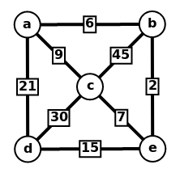
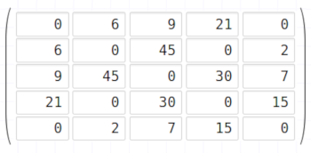

# TSP
## TP Final - Estructuras de Datos y Algoritmos 1

### Farizano, Juan Ignacio

El objetivo de este trabajo práctico es presentar un programa capaz de resolver el problema **TSP** (Travelling Salesman Problem).

#### Requerimientos
En el directorio del programa se deben encontrar los siguientes archivos:
- Makefile
- main.c
- src/matridAdy.c
- src/matrizAdy.h
- src/inputOutput.c
- src/inputOutput.h

#### Uso del programa

Para la compilación del programa se proporciona un archivo Makefile para mayor comodidad, para compilar se debe ejecutar en consola el comando:
```shell
$ make
``` 
Y para correrlo se debe ejecutar el comando:
```shell
$ make ./main.o nombreArchivoEntrada nombreArchivoSalida
```
Donde nombreArchivoEntrada y nombreArchivoSalida son los nombres de los archivos de entrada y salida respectivamente.

#### Archivo de entrada
El archivo de entrada debe ser un archivo de texto .txt siguiendo el siguiente formato:

La primera línea contendrá solo la palabra "Ciudades" (sin comillas).
En la segunda linea irán los nombres de las ciudades a las cuales se viajarán separados por una coma y un espacio, después del nombre de la última ciudad queda solo un salto de línea, sin coma y espacio.
En la tercera línea contendrá solo la palabra "Costos" (sin comillas).
De la cuarta línea en adelante cada línea tendrá la forma:
```
ciudad1,ciudad2,costo
```
donde costo es un número que representa el costo de viajar entre ciudad1 y ciudad2 (cada dato separado solo por una coma, sin espacio).

Por ejemplo para el grafo





el archivo de entrada sería:
```
Ciudades
a, b, c, d, e
Costos
a,b,6
a,c,9
a,d,21
b,c,45
b,e,2
c,d,30
c,e,7
d,e,15
```

Aclaración: Se asume que la ciudad desde donde se comienza a recorrer es la primer ciudad que aparezca en la línea con los nombres de las ciudades. En caso de querer empezar a recorrer desde otra ciudad, simplemente hay que cambiar su lugar y poner su nombre primero.

#### Archivo de salida
En la primera línea del archivo de salida se encontrará el costo del recorrido solución.
En la segunda línea se encontrará solo la palabra "Recorrido" (sin comillas).
Y de la tercer línea en adelante se encontrarán
los costos de viajar entre cada par de ciudades de la solución.

Por ejemplo, para el grafo del ejemplo anterior su solución es:


con un costo total de 62.

Por lo tanto su archivo de salida correspondiente sería:
```
Costo final del recorrido: 62
Recorrido
a,b,6
b,e,2
e,d,15
d,c,30
c,a,9
```

#### Estructuras de datos
Durante la carga de los datos del archivo de entrada, los nombres de las ciudades se almacenarán en un array bidimensional de caracteres de tamaño MAXCIUDADES (esta constante está definida en el archivo inputOutput.h) llamado **ciudades**.

Para guardar el costo de viajar entre ciudades se utiliza una estructura de la forma:

``` C
typedef struct {
  int cantCiudades;
  int** costos;
} _MatrizAdyacencia;
```

donde cada dato representa:
- **cantCiudades**: es la cantidad de ciudades leídas en el archivo de entrada.
- **costos**: es una matriz bidimensional cuadrada de tamaño cantCiudades*cantCiudades, donde sus entradas representan los costos de viajar entre ciudades. El dato en la posición (i, j) representa el costo de viajar de la ciudad i a la ciudad j y es igual al dato en la posición (j,i), de acá se puede observar que la matriz es simétrica.
  
Siguiendo el ejemplo anterior, cantCiudades sería igual 6 y la matriz costos sería:





Para guardar la solución del problema se utiliza un array de enteros de tamaño cantCiudades + 1 llamado **recorrido**, donde cada posición va a ser un paso durante el recorrido de la solución. Debido a la naturaleza del programa, la primer y última posición van a ser iguales a 0 (es decir, la posición inicial).

#### Resolución
Para encontrar la solución se hace uso de una función recursiva declarada de la siguiente forma:
```
int TSP(MatrizAdyacencia matrizAdy, int* costoFinal, int costoActual, int ciudadActual, int cantVisitadas, int* recorrido)
```
donde cada argumento representa:
- **matrizAdy** es la matriz adyacencia respectiva a las ciudades a visitar.
- **costoFinal** es un puntero a un entero que representa el costo mínimo de viajar entre todas las ciudades (es decir, el costo del recorrido solución). Si todavía no se encontró una solución, costoFinal será igual a -1.
- **costoActual** representa el costo de lo recorrido hasta el momento para llegar a la ciudad actual.
- **ciudadActual** representa la ciudad que estoy visitando actualmente en el llamado de la función recursiva.
- **cantVisitadas** representa la cantidad de ciudades que voy visitando, si cantVisitadas es igual a cantCiudades significa que ya visité todas las ciudades y solo falta volver a la ciudad inicial si es posible.
- **recorrido** es la estructura mencionada previamente.


Supongo que el archivo de entrada contiene datos que siempre tendrán una solución. 
Esta función al principio intenta recorrer todos los caminos posibles hasta encontrar un primer camino válido, el costo de este primer recorrido será una cota superior , es decir, si estoy recorriendo y el costo del recorrido actual supera la cota significa que a partir de este punto no puedo encontrar una solución que sea mejor que la que ya tengo y este camino se descarta, de esta forma se reduce considerablemente la cantidad de operaciones a realizar.
En caso de encontrar un nuevo recorrido con un costo inferior a la cota, el costo de este recorrido será mi nueva cota y así sucesivamente hasta finalizar de recorrer todos los caminos posibles.
Una vez finalizado, el recorrido cuyo costo sea la última cota que se haya encontrado será la solución del problema.